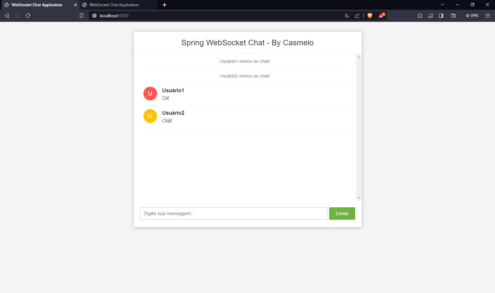

# Chat em Tempo Real com Spring Framework e Websockets

Esta aplicação de chat em tempo real foi desenvolvida com Spring Framework e Websockets no backend e HTML, CSS e JavaScript no frontend. Este aplicativo oferece uma interface simples para multiplos usuários participarem de uma conversa em tempo real.

## Instruções de Uso

1. **Nome de Usuário:**
    - Ao acessar o aplicativo, você será solicitado a fornecer um nome de usuário. Insira um nome de sua escolha e clique em "Entrar".

2. **Enviar Mensagens:**
    - Uma vez dentro da sala de chat, você pode começar a enviar mensagens. Basta digitar a mensagem na caixa de texto na parte inferior da tela e pressionar "Enter" ou clicar no botão de envio.

3. **Participação Contínua:**
    - Você permanecerá na sala de chat enquanto o navegador estiver aberto. Se fechar ou atualizar a página, será necessário fornecer um novo nome de usuário para entrar novamente.


## Executando o Aplicativo Localmente

1. Clone o repositório:

   ```bash
   git clone https://github.com/cas-melo/spring-websocket-chat.git
   ```
2. - Inicie o servidor: RUN em `ChatApplication` (ou equivalente).

3. - Acesse o servidor localmente: `localhost:8080` no seu browser de preferência.

## Screenshots

*Tela inicial*


*Tela chat*


## Contribuição

Sinta-se à vontade para contribuir ou reportar problemas. Basta abrir uma *issue* ou enviar um *pull request*.

## Licença

Este projeto está licenciado sob a [MIT License] - veja o arquivo [LICENSE.md](LICENSE.md) para detalhes.

## Observação

Front end feito por Bouali Ali.
