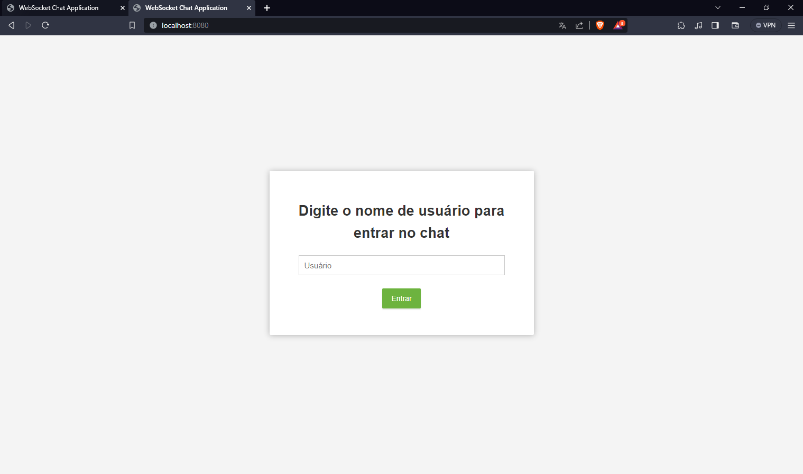
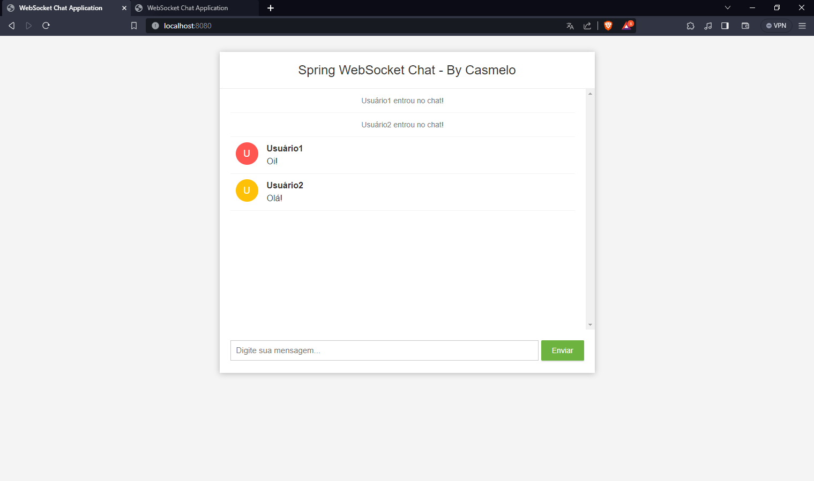

# Real-Time Chat with Spring Framework and Websockets

This real-time chat application was developed with Spring Framework and Websockets on the backend and HTML, CSS, and JavaScript on the frontend. 
This application provides a simple interface for multiple users to engage in real-time conversations.

## Usage Instructions

1. **Username:**
    - Upon accessing the application, you will be prompted to provide a username. Enter a name of your choice and click "Enter."

2. **Sending Messages:**
    - Once inside the chat room, you can start sending messages. Simply type the message in the text box at the bottom of the screen and press "Enter" or click the send button.

3. **Continuous Participation:**
    - You will remain in the chat room as long as the browser is open. If you close or refresh the page, you will need to provide a new username to enter again.

## Running the Application Locally

1. Clone the repository:

   ```bash
   git clone https://github.com/cas-melo/spring-websocket-chat.git
   ```

2. - Start the server: RUN `ChatApplication` (or equivalent).

3. - Access the server locally: `localhost:8080` in your preferred browser.

## Screenshots

*Login page*



*Chat page*


## Contribution

Feel free to contribute or report issues. Simply open an *issue* or submit a *pull request*.

## License

This project is licensed under the [MIT License] - see the [LICENSE.md](LICENSE.md) file for details.

## PS:

Front end made by Bouali Ali.
I just translated
